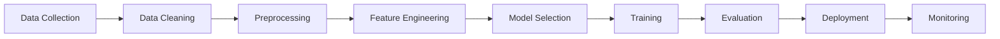
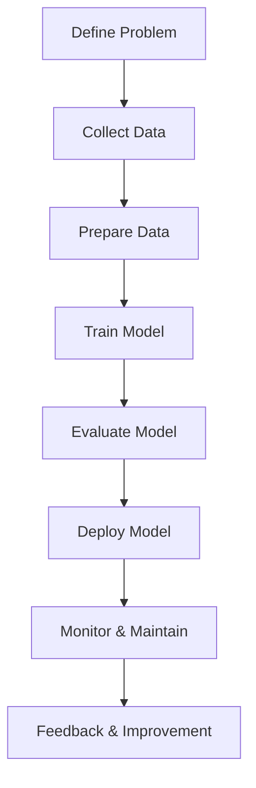
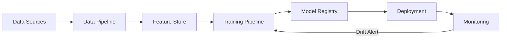
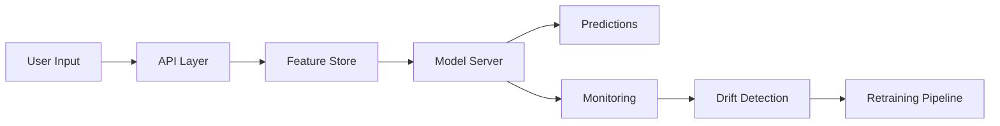

# MACHINE LEARNING – Pipeline, Lifecycle, MLOps, Deep Learning & Interview Questions

A comprehensive reference covering:
- Machine Learning fundamentals
- ML pipeline (GfG)
- ML lifecycle (GfG)
- MLOps principles (ml-ops.org)
- Classic ML + Deep Learning examples
- Mermaid diagrams
- Interview questions from Datacamp, Exponent, GfG, InterviewPrep.org
- Project folder structure

---

# 1. Machine Learning Fundamentals – Q&A

## Q1. What is Machine Learning?

Machine Learning (ML) is a subset of AI enabling systems to learn patterns from data and make predictions/decisions without being explicitly programmed. ML models improve performance as more data becomes available.

ML solves tasks like:
- Classification (spam / not spam)
- Regression (price prediction)
- Clustering (customer segmentation)
- Recommendation (Netflix, Amazon)
- NLP tasks (sentiment, QA)
- Vision tasks (object detection)


## Q2. Types of Machine Learning

### **1. Supervised Learning**
Model learns from labeled data (X → y).  
Algorithms:
- Linear/Logistic Regression
- SVM
- Random Forest, XGBoost
- Neural Networks

Tasks:
- Regression
- Classification


### **2. Unsupervised Learning**
No labels; model finds patterns.  
Algorithms:
- K-Means
- Hierarchical Clustering
- PCA / Dimensionality Reduction

Tasks:
- Clustering
- Anomaly detection


### **3. Reinforcement Learning**
Agents learn by interacting with environment and receiving rewards.

Applications:
- Robotics
- Game AI
- Autonomous driving


## Q3. What is Overfitting vs Underfitting?

- **Overfitting** → Model memorizes training data; poor generalization.  
Fixes:
- Regularization
- Dropout
- More data
- Cross-validation

- **Underfitting** → Model too simple; fails to learn patterns.  
Fixes:
- More complex models
- Feature engineering


# 2. Machine Learning Pipeline

A pipeline is a structured workflow from data ingestion to model deployment.

## **Pipeline Stages**

1. **Data Collection** – databases, APIs, logs, sensors  
2. **Data Cleaning** – handling missing data, outliers, duplicates  
3. **Data Preprocessing** – encoding, scaling, normalization  
4. **Feature Engineering** – feature selection, creation, dimensionality reduction  
5. **Model Selection** – comparing algorithms  
6. **Model Training** – optimization, hyperparameters  
7. **Model Evaluation** – metrics, validation  
8. **Model Deployment** – serving via APIs  
9. **Monitoring** – drift, performance metrics

---

# Mermaid Diagram – ML Pipeline



---

# 3. Machine Learning Lifecycle (GfG)

The lifecycle extends beyond training to full production management.

## Stages:
1. **Problem Definition**
2. **Data Gathering**
3. **Data Preparation**
4. **Model Building**
5. **Evaluation**
6. **Deployment**
7. **Monitoring & Maintenance**
8. **Feedback Loop**

---

# Mermaid Diagram – ML Lifecycle



---

# 4. MLOps Principles

MLOps brings DevOps to ML and includes:

### Key Principles:
- **Versioning** (data, code, models)
- **Reproducibility** (pipelines)
- **Automation** (CI/CD)
- **Testing** (unit tests, integration tests, ML tests)
- **Continuous Training (CT)**
- **Continuous Deployment (CD)**
- **Monitoring** (model drift, data drift)
- **Scalability** (cloud, containers)

---

# Mermaid Diagram – MLOps Architecture



---

# 5. Code Examples (Classic ML + Deep Learning)

## Example 1 – Classic ML (scikit‑learn)

```python
from sklearn.model_selection import train_test_split
from sklearn.linear_model import LogisticRegression
from sklearn.metrics import accuracy_score
from sklearn.datasets import load_breast_cancer

data = load_breast_cancer()
X, y = data.data, data.target

X_train, X_test, y_train, y_test = train_test_split(X, y, test_size=0.2)

model = LogisticRegression(max_iter=1000)
model.fit(X_train, y_train)

preds = model.predict(X_test)
print("Accuracy:", accuracy_score(y_test, preds))
```

---

## Example 2 – Deep Learning (TensorFlow)

```python
import tensorflow as tf
from tensorflow.keras import layers, models

model = models.Sequential([
    layers.Dense(64, activation='relu'),
    layers.Dense(32, activation='relu'),
    layers.Dense(1, activation='sigmoid')
])

model.compile(optimizer='adam', loss='binary_crossentropy', metrics=['accuracy'])

# model.fit(X_train, y_train, epochs=10, batch_size=32)
```

---

## Example 3 – Deep Learning (PyTorch)

```python
import torch
import torch.nn as nn
import torch.optim as optim

class Net(nn.Module):
    def __init__(self):
        super().__init__()
        self.fc1 = nn.Linear(30, 64)
        self.fc2 = nn.Linear(64, 1)

    def forward(self, x):
        x = torch.relu(self.fc1(x))
        return torch.sigmoid(self.fc2(x))

model = Net()
criterion = nn.BCELoss()
optimizer = optim.Adam(model.parameters(), lr=0.001)

# Output: model(torch.tensor(X_train).float())
```

---

# 6. ML Interview Questions

## **General ML Questions**

### Q1. What is the bias-variance tradeoff?
- **Bias** = error from overly-simplistic assumptions  
- **Variance** = sensitivity to fluctuations in training data  
Goal: balance both using regularization, cross-validation.


### Q2. What is regularization?
Technique to reduce overfitting by adding penalty to loss:
- L1 = Lasso  
- L2 = Ridge  


### Q3. What is the difference between bagging and boosting?

| Bagging | Boosting |
|--------|----------|
| Parallel | Sequential |
| Reduces variance | Reduces bias |
| Random Forest | AdaBoost, XGBoost |

---

## **Deep Learning Interview Questions**

### Q1. What is a neural network?
An architecture composed of layers of neurons computing weighted sums and activations.


### Q2. What is backpropagation?
Gradient-based algorithm to update network weights.


### Q3. What is dropout?
Regularization technique that randomly disables neurons during training.

---

## **MLOps Interview Questions**

### Q1. What is model drift?
Mismatch between training distribution and production data.


### Q2. What is a model registry?
A central place to store model versions, metadata, approval status (MLflow, SageMaker).


### Q3. Why do we need CI/CD in ML?
To automate:
- data validation  
- model training  
- testing  
- deployment  
- monitoring  

---

# 7. Example System: End-to-End ML System Diagram


